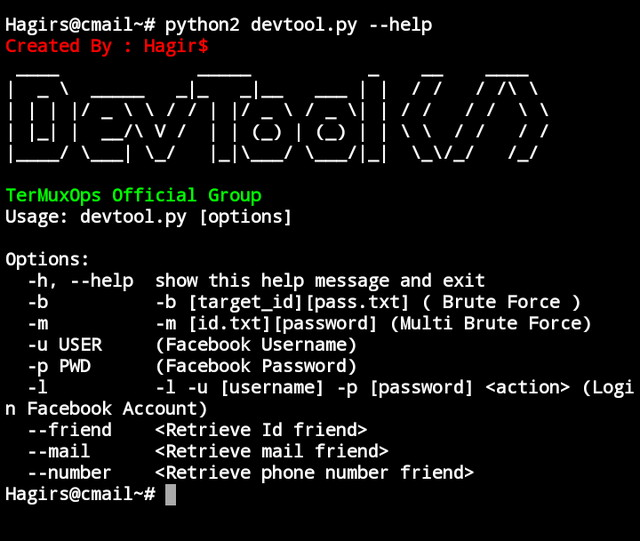

# Devtool V.1

# How To install?
1. pkg install python
2. pkg install python2
3. pkg install git
4. git clone https://github.com/TermuxOps/devtool
5. pip2 install requests
6. pip2 install pyfiglet
7. cd devtool
8. python2 devtool.py --help

# Usage
**Brute Force**
python2 devtool.py -b [target_id] [wordlist.txt]
------------------------------------------------

**Multi Brute Force**
'''python2 devtool.py -m [target_id.txt] [password]'''

**Get Access token**
'''python2 devtool.py -l -u [username] -p [password]
Saved in token.log'''

**Retrieve Friend ID**
'''python2 devtool.py -l -u [username] -p [password] --friend
Saved in data/friend'''

**Retrieve Friend Mail**
'''python2 devtool.py -l -u [username] -p [password] --mail
Saved in data/mail'''

**Retrieve Friend Number**
'''python2 devtool.py -l -u [username] -p [password] --number
Saved in data/phone'''

